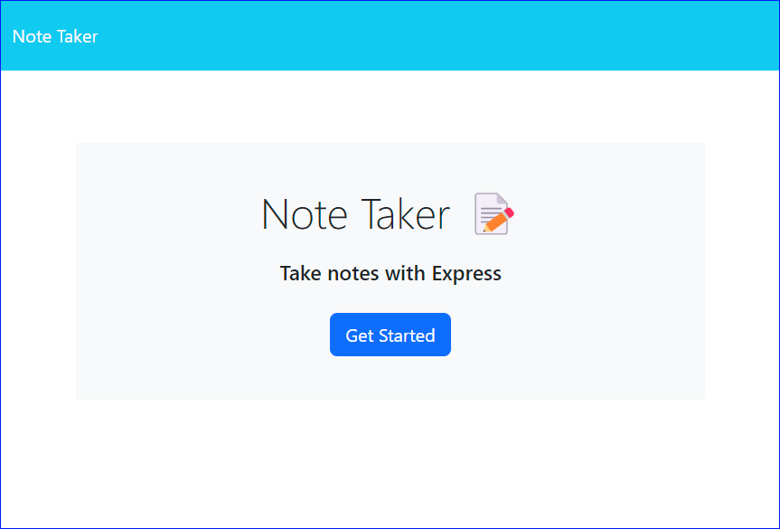

<a ID="readme-top"></a>

<div align="center">

# Huber's Note Taker

  [](https://opensource.org/licenses/MIT)
  [](https://nodejs.org/en) 

</div>


## Description

This application is a Note Taking application that can be used to write and save notes quickly.

It aims to provide a simple online platform to capture thoughts and tasks in the form of notes.

This application is availble online for use and has been developed boilerplate code 

## Table of contents

- <a href="#user-story">User Story<a>
- <a href="#user-acceptance-criteria">User Acceptance Criteria<a>
- [Installation](#installation)
- [Usage](#usage)
- <a href="#screenshots">Video and Screenshots<a>
- [License](#license)
- [Contributing](#contributing)
- [Testing](#testing)
- <a href="#technologies-used">Technologies Used<a>
- [Questions](#questions)

## User Story <a ID="user-story"></a>

This application was developed with this user story in mind:

```
AS A small business owner

I WANT to be able to write and save notes
SO THAT I can organize my thoughts and keep track of tasks I need to complete
```

<p align="right">(<a href="#readme-top">back to top</a>)</p>

## User Acceptance Criteria <a ID="user-acceptance-criteria"></a>

### This application was developed with the below User acceptance criteria:

```
GIVEN a note-taking application

WHEN I open the Note Taker
THEN I am presented with a landing page with a link to a notes page

WHEN I click on the link to the notes page
THEN I am presented with a page with existing notes listed in the left-hand column, plus empty fields to enter a new note title and the note’s text in the right-hand column

WHEN I enter a new note title and the note’s text
THEN a Save icon appears in the navigation at the top of the page

WHEN I click on the Save icon
THEN the new note I have entered is saved and appears in the left-hand column with the other existing notes

WHEN I click on an existing note in the list in the left-hand column
THEN that note appears in the right-hand column

WHEN I click on the Write icon in the navigation at the top of the page
THEN I am presented with empty fields to enter a new note title and the note’s text in the right-hand column

```
### Additional requirements:

```
• A `db.json` file must be used to store and retrieve notes using the `fs` module
• HTML routes that are suggested
  • GET Notes to reutn notes.html
  • GET * (wildcard) to return index.html
• API Routes suggested
  • GET /api/notes should read the db.json file and return saved notes as JSON
  • POST /apo/notes should receive a new note to save and be added to the db.json file.

  #### Bonus

  • DELETE requests - as a bonus, try to add the DELETE route to the applicaiton to support this feature
```

<p align="right">(<a href="#readme-top">back to top</a>)</p>

## Screenshots <a ID = "screenshots"></a>


Splash page for the Note Taker

<div align="center">



</div>

Screenshot of the Notes page

<div align="center">


</div>

<p align="right">(<a href="#readme-top">back to top</a>)</p>

## Installation

This application is hosted online and does not require installation to run.

Here is the published page: <a href="https://hybee234-note-taker-008efcbf19f2.herokuapp.com/notes"> Click here </a>


<p align="right">(<a href="#readme-top">back to top</a>)</p>

## Usage

Once you have accessed the web application (<a href="https://hybee234-note-taker-008efcbf19f2.herokuapp.com/notes"> Click here </a>)

* Add new notes/tasks by clicking on and typing into the Title and Body fields, once both fields have values then a save icon will appear to save the note
* Saved notes will be listed on the left hand panel on the screen, clicking on the saved notes will present their details in "read only" in the main screen
* Clicking on the delete icon (rubbish bin) will remove the saved note
* To clear the main fields and make way for a new note, click on the plus sign
* Save notes persist through sessions and devices so you can update and manage your notes across multiple devices

<p align="right">(<a href="#readme-top">back to top</a>)</p>
    
## License

[](https://opensource.org/licenses/MIT)

This application can be used in conjunction with licensing covered in  <b>MIT Lcensee</b>

(Click on the badge for details of the license)

<p align="right">(<a href="#readme-top">back to top</a>)</p>

## Contributing

To contribute to this application, please reach out to me via my contact details below

<p align="right">(<a href="#readme-top">back to top</a>)</p>

## Testing

Test scripts have not been developed for this application

```

### Additional Testing

* Validate that when you populate the Title and text fields, that the save icon presents on screen to save the note 
* Validate that when resyou save your note (by clicking on the save icon), that your note appears on the left hand panel 
* Validate that clicking on a saved note will open the details of the note will present on the main screen.
* Validate that clicking on a saved note will open details of the note that are read only
* Validate that clicking on the delete icon (rubbish bin) removes the saved note
* Validate that clicking on the plus sign clears the title and text fields
* Validate that your notes persist across different sessions and across devices (e.g. moving from PC to phone)
```

<p align="right">(<a href="#readme-top">back to top</a>)</p>

## Technologies used <a ID="technologies-used"></a>

* Javascript
* Node.js
* Node Package Manager (NPM)
* Express.js
* File System Package
* UUID

<p align="right">(<a href="#readme-top">back to top</a>)</p>


## Questions

- Visit my GitHub page: <a href="https://github.com/hybee234"> hybee234 </a>
  
<p align="right">(<a href="#readme-top">back to top</a>)</p>

